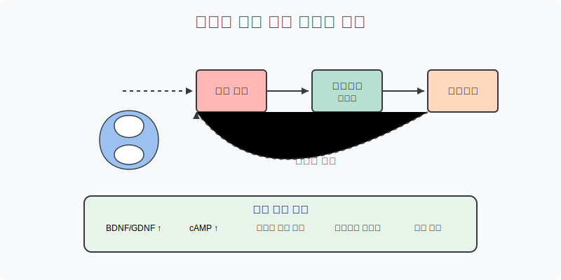
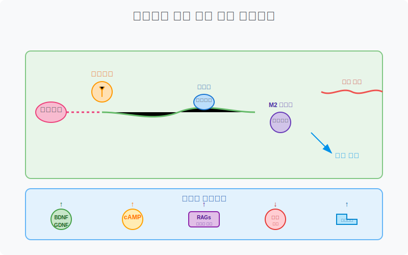
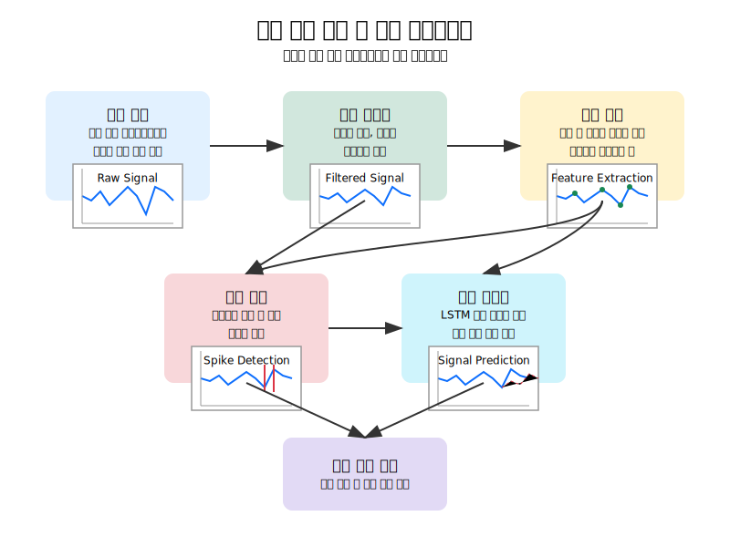
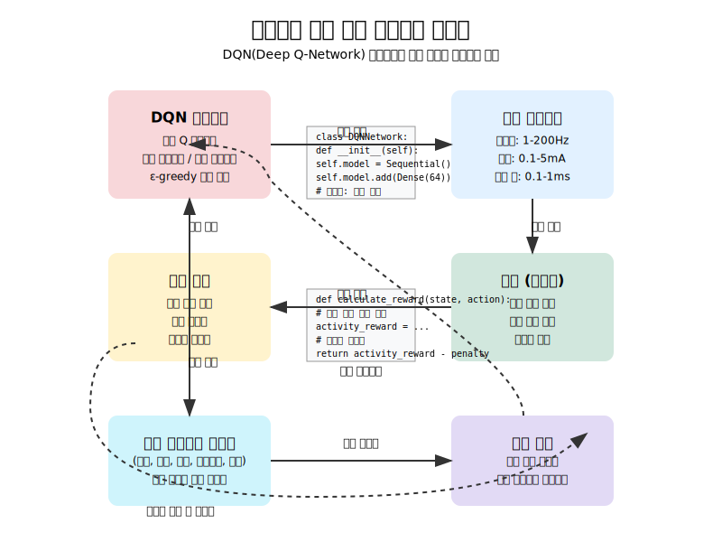

# Adaptive Neural Stimulation System

신경재생을 위한 적응형 전기자극 최적화 시스템

<p align="center">
  
</p>

## 개요

이 프로젝트는 신경 재생과 회복을 촉진하기 위한 적응형 전기자극 시스템을 구현합니다. 강화학습과 딥러닝 기술을 활용하여 신경 신호 패턴을 분석하고 최적의 자극 매개변수를 실시간으로 조정합니다.

### 신경 손상의 유형과 전기자극의 필요성

신경계 손상은 그 원인과 손상 위치에 따라 다양한 유형으로 분류됩니다:

1. **외상성 손상**
   - 척수 손상(SCI): 교통사고, 낙상, 스포츠 부상 등으로 발생하며, 운동 및 감각 기능 손실을 초래
   - 외상성 뇌 손상(TBI): 뇌에 대한 외부 충격으로 인한 손상
   - 말초신경 손상: 압박, 절단, 견인 등으로 인한 손상

2. **질병성 손상**
   - 신경퇴행성 질환: 알츠하이머병, 파킨슨병, 다발성 경화증(MS), 루게릭병(ALS) 등
   - 대사성 신경병증: 당뇨병성 신경병증 등
   - 염증성 신경병증: 길랑-바레 증후군, 만성 염증성 탈수초성 다발신경병증(CIDP) 등

3. **후천성 손상**
   - 독성 물질 노출: 중금속, 화학물질, 약물 등에 의한 신경 독성
   - 방사선 손상: 방사선 치료 후 발생하는 신경 손상
   - 허혈성 손상: 뇌졸중과 같은 혈액 공급 중단으로 인한 손상

**전통적 치료법의 한계:**
현재의 약물 치료, 물리 치료, 수술적 중재 등은 신경 손상에 대한 완전한 회복을 제공하지 못하는 경우가 많습니다. 특히 중추신경계(CNS)의 손상은 자연적 재생 능력이 제한되어 있어 치료가 더욱 어렵습니다.

**전기자극 치료의 필요성:**
전기자극 치료는 다음과 같은 이유로 신경 재생에 중요한 접근법입니다:

1. **생물학적 재생 메커니즘 활성화**: 전기자극은 신경세포의 내인성 재생 경로를 직접 활성화하여 자연 회복 과정을 촉진
2. **약물 침투 개선**: 신경 조직으로의 약물 전달 효율성 증가
3. **시냅스 가소성 촉진**: 신경회로의 재조직화 및 기능적 연결 강화
4. **비침습적 또는 최소침습적 접근**: 많은 전기자극 방법이 수술적 개입 없이 적용 가능
5. **맞춤형 치료 가능성**: 환자별 손상 특성에 따라 자극 매개변수 조정 가능

그러나 최적의 자극 매개변수(진폭, 주파수, 펄스 폭, 파형 등)는 개인별 손상 유형, 손상 정도, 신경학적 상태에 따라 크게 달라질 수 있어, 표준화된 프로토콜 수립이 어렵습니다. 이 시스템은 이러한 도전과제를 해결하기 위해 실시간 신경 신호 모니터링과 강화학습을 활용하여 개인화된 최적 자극 매개변수를 찾는 접근법을 제공합니다.

### 연구 배경

전기자극(ES)은 신경 재생을 촉진하는 유망한 치료법으로, 다음과 같은 메커니즘을 통해 작용합니다:

<p align="center">
  
</p>

- 신경영양인자(BDNF, GDNF) 상향 조절
- cAMP 증가
- 재생 관련 유전자(RAGs) 발현 촉진
- 슈반세포 활성화
- 혈류 개선
- 대식세포 M2 극성화 촉진

이러한 메커니즘은 축삭 성장을 촉진하고 기능 회복을 가속화하는 것으로 알려져 있습니다.

## 시스템 아키텍처 및 작동 원리

본 시스템은 크게 다음과 같은 구성요소로 이루어져 있습니다:

### 1. 데이터 수집 및 전처리 모듈
- **신호 수집**: 신경 신호를 다양한 소스(전극, 임플란트, 외부 장치 등)에서 수집
- **신호 전처리**: 노이즈 제거, 필터링, 정규화 등을 통해 원시 신호를 분석 가능한 형태로 변환
- **특성 추출**: 시간 및 주파수 도메인에서의 유의미한 특성 추출(평균, 표준편차, RMS, 스펙트럼 엔트로피 등)

### 2. 분석 및 의사결정 모듈
- **LSTM 모델**: 시계열 신경 신호 분석 및 예측
- **강화학습 에이전트**: 자극 매개변수 최적화를 위한 DQN(Deep Q-Network) 기반 알고리즘
- **특정 상태-보상 매핑**: 신경 반응과 보상 함수 간의 연결 수립

### 3. 자극 제어 모듈
- **자극 파형 생성**: 다양한 파형(단상, 이상, 삼상, 버스트 등) 생성
- **매개변수 조정**: 진폭, 주파수, 펄스 폭 등의 실시간 조정
- **안전 모니터링**: 자극 한계 설정 및 이상 탐지

### 4. 피드백 및 평가 모듈
- **반응 모니터링**: 자극 후 신경 반응 실시간 분석
- **성능 지표 계산**: 효과성 평가를 위한 다양한 지표 추적
- **학습 데이터 생성**: 강화학습 모델의 지속적 개선을 위한 데이터 생성

### 작동 원리

<p align="center">
  
</p>

1. **신호 획득 및 전처리**:
   - 신경 신호 데이터가 실시간으로 수집되어 노이즈 제거, 필터링, 정규화 등의 전처리 과정을 거침
   - 시간 및 주파수 도메인 특성이 추출되어 시스템의 입력으로 사용됨

2. **상태 표현 및 분석**:
   - 전처리된 신호와 추출된 특성이 시스템의 현재 상태를 표현
   - LSTM 모델이 시계열 패턴을 분석하고 미래 신경 반응을 예측

3. **강화학습 기반 의사결정**:

<p align="center">
  
</p>

   - DQN 에이전트가 현재 상태를 기반으로 최적의 자극 매개변수 조합 결정
   - 선택된 매개변수를 사용하여 자극 파형 생성 및 적용
   - 신경 반응 관찰 및 보상 계산
   - 경험 데이터를 메모리에 저장하고 배치 학습을 통해 모델 지속적 개선

4. **피드백 루프**:
   - 자극 결과에 따른 신경 반응이 다시 입력으로 들어가는 폐루프(closed-loop) 구조
   - 반복적인 학습과 최적화를 통해 개인별 최적 자극 프로토콜 도출

이 시스템은 지속적인 학습과 적응을 통해 환자의 상태 변화에 맞게 자극 매개변수를 실시간으로 조정하는 능력을 갖추고 있습니다.

## 주요 기능

- **신경 신호 처리**: 노이즈 제거, 특성 추출, 패턴 인식
- **강화학습 기반 최적화**: DQN 에이전트를 통한 자극 매개변수 최적화
- **시계열 예측**: LSTM 모델을 활용한 신경 반응 예측
- **적응형 자극 제어**: 실시간 피드백에 기반한 자극 매개변수 조정
- **데이터 시각화**: 신호, 스펙트럼, 최적화 과정 시각화

### 신경 신호 처리 및 분석

<p align="center">
  
</p>

### 강화학습 기반 자극 최적화

<p align="center">
  
</p>

## 시스템 구조

프로젝트는 다음과 같은 모듈로 구성되어 있습니다:

### 유틸리티 모듈
- `signal_processor.py`: 신경 신호 데이터 처리
  - 필터링, 특성 추출, 스파이크 검출, 발화율 계산 등의 기능 제공
- `data_handler.py`: 데이터 로드 및 변환
  - 다양한 형식의 데이터 파일(.csv, .mat, .hdf5 등) 처리
  - 데이터 정규화, 세그먼트화, 시퀀스 데이터 준비 등의 기능
- `stimulation_controller.py`: 전기자극 패턴 생성 및 제어
  - 다양한 파형(단상, 이상, 삼상, 버스트) 생성
  - 자극 매개변수(진폭, 주파수, 펄스 폭) 실시간 조정
- `parameter_optimizer.py`: 자극 매개변수 최적화
  - 그리드 탐색, 입자 군집 최적화(PSO), 베이지안 최적화 등의 알고리즘 구현
- `visualizer.py`: 데이터 시각화
  - 신호, 스펙트로그램, 발화율, 최적화 과정 등의 시각화 기능 제공

### 모델 모듈
- `dqn_agent.py`: DQN 강화학습 에이전트
  - 경험 리플레이, 타겟 네트워크, 엡실론-그리디 탐색 등의 기능 구현
- `lstm_model.py`: LSTM 기반 시계열 예측 모델
  - 단방향 및 양방향 LSTM, 인코더-디코더 구조 등의 모델 구현
- `stimulation_environment.py`: 강화학습 환경
  - 상태 공간, 행동 공간, 보상 함수 정의
  - 자극-반응 시뮬레이션 및 평가

### 메인 애플리케이션
- `adaptive_stimulation_system.py`: 시스템 통합 및 메인 애플리케이션
  - 모든 모듈을 통합하여 전체 시스템 기능 제공
  - 구성 관리, 데이터 흐름 제어, 실험 설정 등

## 설치 방법

이 프로젝트를 실행하기 위해 필요한 패키지를 설치합니다:

```bash
pip install -r requirements.txt
```

## 사용 방법

### 기본 실행

```bash
python adaptive_stimulation_system.py
```

### 커스텀 설정으로 실행

```python
from adaptive_stimulation_system import AdaptiveStimulationSystem

# 시스템 설정
config = {
    'sampling_rate': 1000.0,
    'sequence_length': 100,
    'feature_dim': 5,
    'use_lstm': True,
    'use_reinforcement_learning': True,
    'save_path': 'results',
    'model_path': 'models/saved'
}

# 시스템 인스턴스 생성
system = AdaptiveStimulationSystem(config)

# 데이터 로드
data, sampling_rate = system.load_data('path_to_data.csv')

# 데이터 전처리
processed_data = system.preprocess_data(data)

# 강화학습 에이전트 학습
rewards = system.train_dqn(num_episodes=100)

# 적응형 자극 적용
result = system.adaptive_stimulation(processed_data, duration=5.0)

# 결과 시각화
system.visualize_results({
    'signal': processed_data,
    'stimulation_waveform': result['stimulation_waveform'],
    'rewards': rewards
})
```

## 개발 방향

이 프로젝트의 향후 개발 방향은 다음과 같습니다:

1. **최적화 알고리즘 개선**: 더 효율적인 매개변수 탐색을 위한 알고리즘 개발
2. **생체 모델 통합**: 더 현실적인 신경 반응 모델링을 위한 생체 모델 통합
3. **하드웨어 인터페이스**: 실제 자극 장치와의 인터페이스 구현
4. **임상 데이터 분석**: 실제 환자 데이터에 기반한 모델 검증 및 개선

## 연구 의의

본 시스템은 다음과 같은 측면에서 신경 재생 연구에 기여할 수 있습니다:

- 환자별 맞춤형 자극 매개변수 최적화
- 신경 재생 과정의 실시간 모니터링 및 피드백
- 다양한 신경 손상 유형에 대한 최적 자극 패턴 발견
- 신경 재생 메커니즘에 대한 깊은 이해 촉진

## 참고 문헌

### 전기자극 기반 신경재생 연구
1. Zhang, X., & Ji, L. (2022). Electrical stimulation for neural regeneration: A comprehensive review. *Neural Regeneration Research*, 17(12), 2587-2597.
2. Gordon, T., & English, A. W. (2016). Strategies to promote peripheral nerve regeneration: electrical stimulation and/or exercise. *European Journal of Neuroscience*, 43(3), 336-350.
3. Yao, L., et al. (2018). Electrical stimulation optimizes the polarization of cortical neurons and enhances motor function recovery after spinal cord injury. *Neural Regeneration Research*, 13(12), 2112-2119.

### 신경 신호 처리 및 분석
4. Quiroga, R. Q., & Panzeri, S. (2013). Extracting information from neuronal populations: information theory and decoding approaches. *Nature Reviews Neuroscience*, 14(8), 584-600.
5. Lewicki, M. S. (1998). A review of methods for spike sorting: the detection and classification of neural action potentials. *Network: Computation in Neural Systems*, 9(4), R53-R78.
6. Rey, H. G., et al. (2015). Past, present and future of spike sorting techniques. *Brain Research Bulletin*, 119, 106-117.

### 강화학습 및 LSTM 모델
7. Barto, A. G., & Sutton, R. S. (2018). *Reinforcement learning: An introduction*. MIT press.
8. Mnih, V., et al. (2015). Human-level control through deep reinforcement learning. *Nature*, 518(7540), 529-533.
9. Hochreiter, S., & Schmidhuber, J. (1997). Long short-term memory. *Neural computation*, 9(8), 1735-1780.
10. Chen, L., et al. (2020). Deep learning based online predictions of neural responses to electrical stimulation for data-driven neuromodulation. *Scientific Reports*, 10(1), 1-10.

### 임상 응용 연구
11. Irimia, D., et al. (2019). The neurorestorative effect of electrical stimulation along the corticospinal tract for spinal cord injury. *Physiological Measurement*, 40(7), 074004.
12. Ohtake, Y., et al. (2015). The effect of electrical stimulation and mechanistic target of rapamycin complex 1 (mTORC1) inhibition on corticospinal axons after spinal cord injury. *Experimental Neurology*, 269, 1-12.
13. Tashiro, S., & Shinozaki, M. (2021). Functional electrical stimulation for motor recovery of spinal cord injury: review of experimental and clinical studies. *International Journal of Molecular Sciences*, 22(16), 8398.
14. Lu, P., et al. (2016). Long-distance axonal growth from human induced pluripotent stem cells after spinal cord injury. *Neuron*, 92(1), 114-125.

## 라이선스

이 프로젝트는 MIT 라이선스 하에 배포됩니다. 자세한 내용은 [LICENSE](LICENSE) 파일을 참조하세요.
