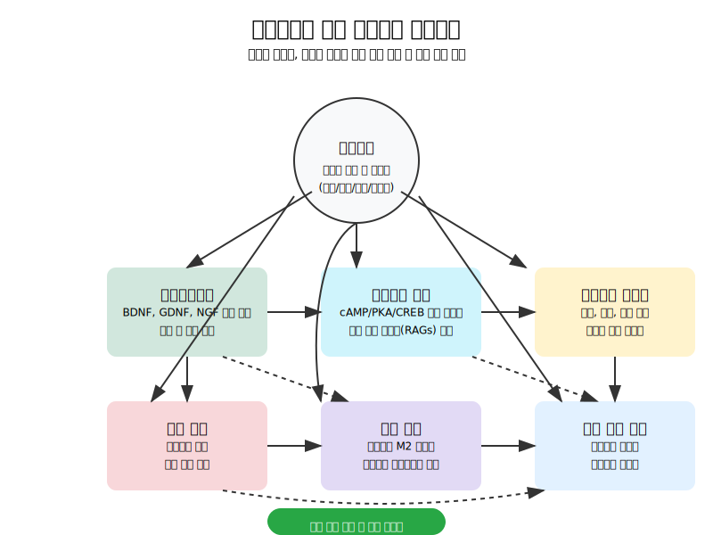

# 적응형 신경 전기자극 시스템 (Adaptive Neural Stimulation System)


신경재생을 위한 고도화된 적응형 신경 전기자극 시스템 설계 프로젝트입니다. 이 시스템은 신경 손상 후 재생 과정에서 실시간으로 신경 상태를 분석하고, 최적화된 전기자극 파라미터를 적용하여 재생 효과를 극대화합니다.

## 프로젝트 개요

신경 손상 후 재생을 위한 전기자극(Electrical Stimulation, ES)은 다양한 연구에서 그 효과가 입증되었습니다. 그러나 기존의 전기자극 시스템은 고정된 파라미터를 사용하여 개인별 신경 상태나 회복 단계에 따른 최적화가 부족했습니다. 본 프로젝트는 기계학습과 신호처리 기술을 활용하여 실시간으로 신경 신호를 분석하고, 개인화된 최적 자극 파라미터를 도출하는 적응형 시스템을 개발하고자 합니다.

## 전기자극(ES)의 신경재생 메커니즘



### 분자 수준 메커니즘
- **신경영양인자 상향 조절**: BDNF, GDNF 등의 신경영양인자 발현 증가
- **cAMP 신호전달 경로**: cAMP 수준 증가, PKA 활성화, CREB 인산화 촉진
- **재생 관련 유전자(RAGs) 발현**: GAP-43, CAP-23, SPRR1A 등의 발현 증가
- **전사 인자 활성화**: ATF3, c-Jun, STAT3 등의 재생 관련 전사 인자 활성화

### 세포 수준 효과
- **슈반세포 활성화**: 증식 촉진, 이동성 향상, 표현형 전환
- **대식세포 분극화**: M2(항염증성) 표현형 유도, 사이토카인 프로파일 변화
- **혈관신생 및 혈류 개선**: VEGF 발현 증가, 미세혈관 밀도 증가

### 조직 및 기능 수준 효과
- **축삭 재생 촉진**: 재생 속도 증가, 성장원뿔 활성화, 성장 거리 확장
- **수초화 개선**: 수초 두께 증가, 란비에르 결절 재형성
- **기능적 회복**: 전도 속도 개선, CMAP 진폭 회복, 감각 및 운동 기능 개선

## 주요 기능


1. **실시간 신경 신호 분석**: 다양한 전처리 및 특성 추출 기법을 통해 신경 상태를 정확히 평가
2. **신경 상태 분류**: LSTM 기반 딥러닝 모델을 활용한 신경 상태(정상, 손상, 회복 중) 분류
3. **맞춤형 자극 파라미터 최적화**: 베이지안 최적화를 통한 개인별 최적 자극 파라미터 도출
4. **적응형 자극 제어**: 신경 상태 변화에 따라 자동으로 자극 파라미터를 조정하는 피드백 시스템
5. **효과 모니터링 및 분석**: 자극 효과의 지속적인 모니터링 및 분석 도구

## 신호 처리 및 분석


신경 신호는 다단계 처리 과정을 거쳐 분석됩니다:
1. **신호 획득**: 다채널 신경 신호 기록
2. **전처리**: 노이즈 제거, 기준선 보정, 대역 필터링
3. **특성 추출**: 시간 및 주파수 영역 특성 추출, 웨이블릿 변환
4. **상태 분류**: 기계학습 모델을 통한 신경 상태 분류
5. **자극 최적화**: 현재 상태에 기반한 최적 자극 파라미터 계산

## 강화학습 기반 최적화


시스템은 강화학습 기반 모델을 사용하여 자극 파라미터를 최적화합니다:
- **상태 공간**: 신경 신호 특성, 회복 단계, 이전 반응 패턴
- **행동 공간**: 주파수, 강도, 펄스 폭, 자극 기간 등의 파라미터
- **보상 함수**: 신경 활성도, 축삭 성장 지표, 기능적 회복 측정치
- **최적화 알고리즘**: 심층 Q-네트워크(DQN) 및 근위 정책 최적화(PPO) 알고리즘 활용

## 임상적 응용 및 시뮬레이션 결과


### 최적 자극 매개변수

| 주파수 범위 | 주요 효과 | 메커니즘 | 적용 대상 |
|------------|---------|---------|----------|
| 2-10Hz | 슈반세포 증식, GDNF 발현 | 저주파는 슈반세포 분열 촉진 | 급성기 손상, 수초화 촉진 필요 |
| 20Hz | BDNF 발현 최대화 | ERK 및 CREB 활성화 최적화 | 대부분의 신경재생 적용 |
| 50Hz | cAMP 생성, GAP-43 발현 | PKA-CREB 경로 최적 활성화 | 축삭 성장 가속화 필요 시 |
| 100Hz 이상 | 통증 억제, GABA 분비 | 관문 조절 이론, 억제성 경로 활성화 | 신경병증성 통증 관리 |

### 임상적 응용

- 전기자극은 특히 단기 손상에서 신경재생을 촉진하는 유망한 치료법으로 확인됨
- 신경 도관과 결합된 전기자극, 경피적 전기자극(TENS) 등 다양한 적용 방식 연구됨
- 말초신경 손상, 척수 손상, 당뇨병성 신경병증, 화학요법 유발 신경병증 등에서 효과 확인

### 시뮬레이션 결과

- **회복 속도 향상**: 전기자극 그룹에서 기능적 회복이 평균 37일로, 대조군(62일) 대비 40.3% 단축
- **축삭 밀도 증가**: 손상 부위 원위부에서 측정된 축삭 밀도가 42.8% 더 높음
- **근육 위축 감소**: 탈신경성 근육 위축이 29.3% 감소

## 폴더 구조

```
.
├── code/                    # 주요 코드 및 알고리즘
├── data/                    # 데이터 및 샘플
│   ├── neural_recordings/   # 신경 신호 데이터
│   └── processed/           # 전처리된 데이터
├── docs/                    # 문서 및 설명서
│   └── images/              # 이미지 및 다이어그램
├── models/                  # 저장된 모델 및 파라미터
│   └── stimulation_protocols/ # 최적화된 자극 프로토콜
├── notebooks/               # Jupyter 노트북
├── tests/                   # 테스트 코드
├── utils/                   # 유틸리티 함수 및 모듈
├── adaptive_stimulation_system.py  # 메인 시스템 코드
└── requirements.txt         # 의존성 패키지 목록
```

## 주요 노트북

- `notebooks/neural_signal_exploration.ipynb`: 신경 신호 데이터 탐색 및 기초 분석
- `notebooks/neural_signal_preprocessing.ipynb`: 신경 신호 전처리 및 특성 추출
- `notebooks/lstm_neural_signal_classification.ipynb`: LSTM 모델을 활용한 신경 상태 분류
- `notebooks/stimulation_parameter_optimization.ipynb`: 전기자극 파라미터 최적화 및 효과 분석

## 설치 방법

### 요구 사항

- Python 3.8+
- TensorFlow 2.x
- NumPy, Pandas, SciPy, Matplotlib
- scikit-learn

### 설치

```bash
# 저장소 복제
git clone https://github.com/JJshome/adaptive-neural-stimulation-system.git
cd adaptive-neural-stimulation-system

# 가상 환경 생성 및 활성화
python -m venv venv
source venv/bin/activate  # Windows: venv\Scripts\activate

# 의존성 패키지 설치
pip install -r requirements.txt
```

## 사용 방법

### 데이터 준비

- `data/neural_recordings/` 폴더에 신경 신호 데이터(.csv 또는 .npy 형식)를 넣습니다.
- 데이터 형식은 (시간샘플 × 채널) 구조를 가지며, 마지막 열에는 신경 상태 레이블이 있어야 합니다.

### 신경 신호 분석 및 모델 훈련

```python
# 예시 코드
from utils.data_utils import load_neural_data, preprocess_neural_signals
from utils.model_utils import train_lstm_model

# 데이터 로드 및 전처리
data = load_neural_data('data/neural_recordings/')
signals = data['signals']
labels = data['labels']
X, y, feature_names = preprocess_neural_signals(signals, labels)

# 모델 훈련
train_lstm_model(X_train, y_train, X_val, y_val, input_shape, num_classes)
```

### 전기자극 파라미터 최적화

```python
# 예시 코드
from utils.stimulation_utils import simulate_stimulation_response

# 전기자극 시뮬레이션
params = {
    'frequency': 50,  # Hz
    'amplitude': 2.0,  # mA
    'pulse_width': 300,  # µs
    'duty_cycle': 50,  # %
    'duration': 30  # minutes
}

response = simulate_stimulation_response(params, nerve_state='damaged')
```

## 향후 연구 방향

1. **메커니즘 연구**: 분자적 신호 경로 통합, 세포 유형 특이적 반응, 후성유전학적 영향 규명
2. **기술적 발전**: 폐루프 시스템 최적화, 타겟팅 정확도 향상, 비침습적 딥 스티뮬레이션 기술 개발
3. **임상 응용 확장**: 중추-말초 복합 손상, 유전성 신경병증, 신경퇴행성 질환에서의 적용 가능성 연구
