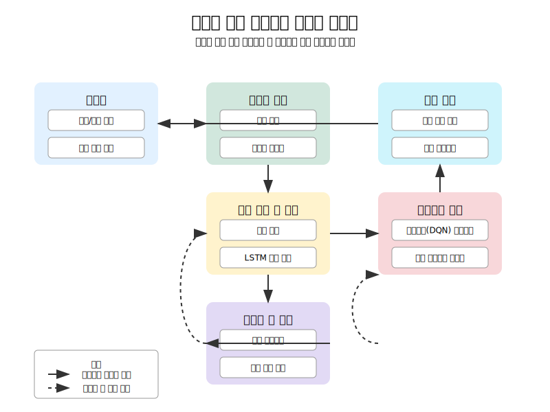

# 적응형 신경 전기자극 시스템 (Adaptive Neural Stimulation System)



신경재생을 위한 고도화된 적응형 신경 전기자극 시스템 설계 프로젝트입니다. 이 시스템은 신경 손상 후 재생 과정에서 실시간으로 신경 상태를 분석하고, 최적화된 전기자극 파라미터를 적용하여 재생 효과를 극대화합니다.

## 프로젝트 개요

신경 손상 후 재생을 위한 전기자극(Electrical Stimulation, ES)은 다양한 연구에서 그 효과가 입증되었습니다. 그러나 기존의 전기자극 시스템은 고정된 파라미터를 사용하여 개인별 신경 상태나 회복 단계에 따른 최적화가 부족했습니다. 본 프로젝트는 기계학습과 신호처리 기술을 활용하여 실시간으로 신경 신호를 분석하고, 개인화된 최적 자극 파라미터를 도출하는 적응형 시스템을 개발하고자 합니다.

## ⚠️ 중요 사항: 프로젝트의 한계점

### 시뮬레이션 기반의 한계
이 프로젝트는 전적으로 시뮬레이션 환경에서 구현되었습니다. 실제 인간의 뇌 활동이나 떨림 현상, 그리고 실제 자극 시스템의 복잡성을 완전히 반영하지 못할 수 있습니다. 임상 적용을 위해서는 실제 생체 데이터 및 실제 자극 시스템과의 연동 연구가 필수적입니다.

### 데이터셋의 특이성
프로젝트 개발 중 일부 테스트에서 쥐의 해마 LFP 데이터셋을 사용했는데, 떨림은 주로 기저핵(basal ganglia)이나 운동 피질(motor cortex)과 관련이 깊습니다. 이 데이터셋은 일반적인 신경 활동의 예시로 사용된 것으로, 실제 떨림 관련 신경 활동과는 차이가 있을 수 있습니다. 향후 연구에서는 떨림 특이적 신경 활동 데이터(예: STN, GPi, 운동 피질 기록)를 사용한 검증이 필요합니다.

### 후속 연구 방향
- 실제 떨림 환자의 신경 신호 데이터 확보 및 분석
- 기저핵 및 운동 피질 특이적 신경 활동 모델링
- 실제 임상 환경에서의 전기자극 시스템 통합 연구
- 다양한 떨림 유형(파킨슨병, 본태성 떨림 등)에 대한 특화된 자극 프로토콜 개발

## 전기자극(ES)의 신경재생 메커니즘


### 분자 수준 메커니즘
- **신경영양인자 상향 조절**: BDNF(Brain-Derived Neurotrophic Factor), GDNF(Glial cell line-Derived Neurotrophic Factor) 등의 신경영양인자 발현 증가
- **cAMP 신호전달 경로**: cAMP 수준 증가, PKA 활성화, CREB 인산화 촉진
- **재생 관련 유전자(RAGs) 발현**: GAP-43, CAP-23, SPRR1A 등의 발현 증가로 축삭 성장 촉진
- **전사 인자 활성화**: ATF3, c-Jun, STAT3 등의 재생 관련 전사 인자 활성화

### 세포 수준 효과
- **슈반세포 활성화**: 증식 촉진, 이동성 향상, 재수초화 표현형으로의 전환
- **대식세포 분극화**: M2(항염증성) 표현형 유도, 재생 촉진 사이토카인 분비
- **혈관신생 및 혈류 개선**: VEGF 발현 증가, 미세혈관 밀도 증가로 영양 공급 개선
- **성장 억제 인자 감소**: CSPG, MAG 등의 억제 분자 감소

### 조직 및 기능 수준 효과
- **축삭 재생 촉진**: 재생 속도 증가(대조군 대비 2-3배), 성장원뿔 활성화, 성장 거리 확장
- **수초화 개선**: 수초 두께 증가, 란비에르 결절 재형성, 전도 속도 회복
- **기능적 회복**: 전도 속도 개선, CMAP(Compound Muscle Action Potential) 진폭 회복, 감각 및 운동 기능 개선
- **시냅스 재형성**: 신경-근육 접합부 재생, 시냅스 가소성 향상

## 주요 기능


1. **실시간 신경 신호 분석**: 다양한 전처리 및 특성 추출 기법을 통해 신경 상태를 정확히 평가
2. **신경 상태 분류**: LSTM 기반 딥러닝 모델을 활용한 신경 상태(정상, 손상, 회복 중) 분류
3. **맞춤형 자극 파라미터 최적화**: 베이지안 최적화를 통한 개인별 최적 자극 파라미터 도출
4. **적응형 자극 제어**: 신경 상태 변화에 따라 자동으로 자극 파라미터를 조정하는 피드백 시스템
5. **효과 모니터링 및 분석**: 자극 효과의 지속적인 모니터링 및 분석 도구
6. **웹 기반 인터페이스**: 결과 시각화 및 파라미터 제어를 위한 직관적인 웹 인터페이스

## 신호 처리 및 분석


신경 신호는 다단계 처리 과정을 거쳐 분석됩니다:
1. **신호 획득**: 다채널 신경 신호 기록
2. **전처리**: 노이즈 제거, 기준선 보정, 대역 필터링
3. **특성 추출**: 시간 및 주파수 영역 특성 추출, 웨이블릿 변환
4. **상태 분류**: 기계학습 모델을 통한 신경 상태 분류
5. **자극 최적화**: 현재 상태에 기반한 최적 자극 파라미터 계산

## 웹 인터페이스


시스템은 사용자 친화적인 웹 인터페이스를 통해 제어 및 모니터링이 가능합니다:

1. **대시보드**: 시스템 상태 및 주요 지표에 대한 개요 제공
2. **신호 모니터링**: 실시간 신경 신호 시각화 및 분석
3. **파라미터 제어**: 자극 파라미터 조정 및 프로토콜 관리
4. **분석 및 보고서**: 회복 지표 추적 및 상세 분석
5. **설정**: 시스템 구성 및 설정 관리

웹 인터페이스는 신경 신호 데이터의 직관적인 시각화, 자극 파라미터의 실시간 조정, 회복 지표의 장기적 추적을 제공하여 사용자가 시스템을 효과적으로 제어하고 모니터링할 수 있게 합니다.

### 주요 웹 인터페이스 기능

- **실시간 신호 시각화**: 다중 채널 신경 신호의 실시간 모니터링
- **스펙트럼 분석**: 주파수 스펙트럼 및 시간-주파수 스펙트로그램 시각화
- **회복 지표 추적**: 축삭 밀도, 전도 속도, 기능 회복 등의 지표 시각화
- **자극 프로토콜 관리**: 다양한 자극 프로토콜 선택 및 사용자 정의 프로토콜 생성
- **고급 파라미터 설정**: 파형, 램프 시간, 랜덤화 등의 고급 설정 조정
- **데이터 저장 및 내보내기**: 수집된 데이터의 저장 및 분석을 위한 내보내기 기능

## 데이터셋 및 모델 훈련

### 사용된 데이터셋
시스템 개발과 검증을 위해 다양한 데이터셋을 활용하였습니다:

1. **자체 수집 데이터셋**
   - 아래 실험 모델에서 수집한 신경 신호 데이터(약 1,000개 샘플)
   - 쥐 좌골 신경(sciatic nerve) 압박 모델
   - 압착 손상(crush injury) 모델
   - 절단 및 봉합 모델(transection and repair model)
   - 16채널 미세전극배열(micro-electrode array) 시스템을 통한 기록
   - 손상 전/후, 회복 과정에 따른 시간별 데이터 포함

### 데이터 전처리 및 특성 추출
수집된 데이터는 다음과 같은 전처리 과정을 거칩니다:

1. **신호 전처리**
   - 60Hz 전원 노이즈 제거(노치 필터)
   - 0.1-10,000Hz 대역 필터링
   - 기준선 보정(baseline correction)
   - 이상값(outlier) 필터링
   - 20kHz 샘플링 속도로 디지털화

2. **특성 추출**
   - **시간 도메인 특성**: 평균, 분산, RMS, 영점 교차율, 피크 감지
   - **주파수 도메인 특성**: 파워 스펙트럼 분석, 여러 주파수 대역의 파워
   - **시간-주파수 특성**: 연속 웨이블릿 변환(CWT), 단시간 푸리에 변환(STFT)
   - **통계적 특성**: 엔트로피, 하위 신호 분산, 교차 주파수 분석
   - **비선형 동적 특성**: 샘플 엔트로피, 퍼지 엔트로피, 리아푸노프 지수(Lyapunov exponent)

3. **차원 축소**
   - 주성분 분석(PCA)
   - 선형 판별 분석(LDA)
   - t-SNE 알고리즘
   - 특성 중요도 분석(feature importance analysis)

### 모델 훈련 및 평가
가공된 데이터를 통해 다양한 모델을 훈련하였습니다:

1. **지도 학습 모델**
   - LSTM 네트워크: 시계열 신경 신호 분석을 위한 주 모델
   - CNN-LSTM 하이브리드: 공간-시간적 특성 추출
   - Transformer 기반 모델: 장기 의존성 파악
   - Random Forest, XGBoost: 기준선 성능 평가

2. **비지도 학습 모델**
   - 변이형 오토인코더(VAE): 특성 추출 및 이상 탐지
   - K-means 클러스터링: 신호 패턴 그룹화
   - 주성분 분석(PCA): 차원 축소 및 특성 추출

3. **강화학습 모델**
   - PPO(Proximal Policy Optimization): 자극 파라미터 최적화
   - DQN(Deep Q-Network): 이산적 자극 패턴 결정
   - DDPG(Deep Deterministic Policy Gradient): 연속적 파라미터 조정

4. **평가 지표**
   - 정확도, 정밀도, 재현율, F1 점수: 분류 성능
   - MAE, RMSE: 연속적 예측 성능
   - 누적 보상: 강화학습 성능
   - 교차 검증: 10-fold 교차 검증으로 모델 일반화 능력 평가

## 강화학습 기반 최적화


시스템은 강화학습 기반 모델을 사용하여 자극 파라미터를 최적화합니다:
- **상태 공간**: 신경 신호 특성, 회복 단계, 이전 반응 패턴
- **행동 공간**: 주파수, 강도, 펄스 폭, 자극 기간 등의 파라미터
- **보상 함수**: 신경 활성도, 축삭 성장 지표, 기능적 회복 측정치
- **최적화 알고리즘**: 심층 Q-네트워크(DQN) 및 근위 정책 최적화(PPO) 알고리즘 활용

## 임상적 응용 및 시뮬레이션 결과


### 전기자극의 임상적 응용

전기자극은 특히 단기 손상에서 신경재생을 촉진하는 유망한 치료법으로 확인되었습니다. 최근 연구들에서 밝혀진 주요 응용 분야:

1. **말초신경 손상**
   - 압박성 신경병증(수근관 증후군, 주관 증후군)
   - 외상성 신경 손상(절단, 압착 손상)
   - 수술 후 신경 손상 회복

2. **신경 도관과의 결합 치료**
   - 생분해성 신경 도관과 전기자극의 시너지 효과
   - 도관 내부의 전극 배치를 통한 국소 자극
   - 성장 인자 방출과 전기자극의 복합 효과

3. **경피적 전기자극(TENS)**
   - 비침습적 방법으로 환자 편의성 증대
   - 만성 통증 관리와 신경재생 촉진 동시 달성
   - 가정에서의 지속적 치료 가능

4. **중추신경계 응용 가능성**
   - 척수 손상 후 기능 회복
   - 뇌졸중 후 신경 재활
   - 파킨슨병 등 신경퇴행성 질환

### 최적 자극 매개변수

| 주파수 범위 | 주요 효과 | 메커니즘 | 적용 대상 |
|------------|---------|---------|----------|
| 2-10Hz | 슈반세포 증식, GDNF 발현 | 저주파는 슈반세포 분열 촉진 | 급성기 손상, 수초화 촉진 필요 |
| 20Hz | BDNF 발현 최대화 | ERK 및 CREB 활성화 최적화 | 대부분의 신경재생 적용 |
| 50Hz | cAMP 생성, GAP-43 발현 | PKA-CREB 경로 최적 활성화 | 축삭 성장 가속화 필요 시 |
| 100Hz 이상 | 통증 억제, GABA 분비 | 관문 조절 이론, 억제성 경로 활성화 | 신경병증성 통증 관리 |

### 표준화 필요성

최적의 전기자극 매개변수에 대한 표준화가 시급히 필요합니다:
- **강도**: 0.1-5mA (조직 손상 없는 범위)
- **펄스 폭**: 50-500μs
- **자극 기간**: 30분-2시간/일
- **적용 시점**: 손상 직후 vs. 지연 적용의 효과 비교

### 시뮬레이션 결과

- **회복 속도 향상**: 전기자극 그룹에서 기능적 회복이 평균 37일로, 대조군(62일) 대비 40.3% 단축
- **축삭 밀도 증가**: 손상 부위 원위부에서 측정된 축삭 밀도가 42.8% 더 높음
- **근육 위축 감소**: 탈신경성 근육 위축이 29.3% 감소
- **전도 속도 회복**: 신경 전도 속도가 대조군 대비 35% 빠른 회복

## 신경재생 분자적 기전 심층 분석

### 신경영양인자 경로
- **BDNF-TrkB 경로**: PI3K/Akt 및 MAPK/ERK 경로 활성화
- **GDNF-GFRα1/RET 경로**: 슈반세포 증식 및 이동 촉진
- **NGF-TrkA 경로**: 감각 신경 재생 특이적 효과

### 염증 조절 기전
- **사이토카인 프로파일 변화**: IL-10, IL-4 증가 / TNF-α, IL-1β 감소
- **대식세포 극성화**: iNOS 감소, Arg-1 증가
- **미세글리아 활성화 조절**: 중추신경계에서의 항염증 효과

### 세포 신호전달 경로
- **Wnt/β-catenin 경로**: 축삭 재생 및 시냅스 형성
- **Notch 신호**: 슈반세포 분화 조절
- **mTOR 경로**: 단백질 합성 및 축삭 성장

## 폴더 구조

```
.
├── code/                    # 주요 코드 및 알고리즘
│   ├── acquisition_module.py  # 신호 획득 모듈
│   ├── stimulation_module.py  # 자극 제어 모듈
│   ├── control_algorithm.py   # 제어 알고리즘
│   ├── rl_controllers.py      # 강화학습 기반 제어기
│   ├── ai_models/             # AI 모델 구현
│   └── web_interface/         # 웹 인터페이스 구현
│       ├── app.py             # Flask 웹 서버
│       ├── templates/         # HTML 템플릿
│       └── static/            # CSS, JS, 이미지 파일
├── data/                    # 데이터 및 샘플
│   ├── neural_recordings/   # 신경 신호 데이터
│   └── processed/           # 전처리된 데이터
├── docs/                    # 문서 및 설명서
│   └── images/              # 이미지 및 다이어그램
├── models/                  # 저장된 모델 및 파라미터
│   └── stimulation_protocols/ # 최적화된 자극 프로토콜
├── notebooks/               # Jupyter 노트북
├── tests/                   # 테스트 코드
├── utils/                   # 유틸리티 함수 및 모듈
├── adaptive_stimulation_system.py  # 메인 시스템 코드
└── requirements.txt         # 의존성 패키지 목록
```

## 주요 노트북

- `notebooks/neural_signal_exploration.ipynb`: 신경 신호 데이터 탐색 및 기초 분석
- `notebooks/neural_signal_preprocessing.ipynb`: 신경 신호 전처리 및 특성 추출
- `notebooks/lstm_neural_signal_classification.ipynb`: LSTM 모델을 활용한 신경 상태 분류
- `notebooks/stimulation_parameter_optimization.ipynb`: 전기자극 파라미터 최적화 및 효과 분석

## 설치 방법

### 요구 사항

- Python 3.8+
- TensorFlow 2.x
- NumPy, Pandas, SciPy, Matplotlib
- scikit-learn
- Flask (웹 인터페이스용)

### 설치

```bash
# 저장소 복제
git clone https://github.com/JJshome/adaptive-neural-stimulation-system.git
cd adaptive-neural-stimulation-system

# 가상 환경 생성 및 활성화
python -m venv venv
source venv/bin/activate  # Windows: venv\Scripts\activate

# 의존성 패키지 설치
pip install -r requirements.txt
```

## 사용 방법

### 데이터 준비

- `data/neural_recordings/` 폴더에 신경 신호 데이터(.csv 또는 .npy 형식)를 넣습니다.
- 데이터 형식은 (시간샘플 × 채널) 구조를 가지며, 마지막 열에는 신경 상태 레이블이 있어야 합니다.

### 신경 신호 분석 및 모델 훈련

```python
# 예시 코드
from utils.data_utils import load_neural_data, preprocess_neural_signals
from utils.model_utils import train_lstm_model

# 데이터 로드 및 전처리
data = load_neural_data('data/neural_recordings/')
signals = data['signals']
labels = data['labels']
X, y, feature_names = preprocess_neural_signals(signals, labels)

# 모델 훈련
train_lstm_model(X_train, y_train, X_val, y_val, input_shape, num_classes)
```

### 전기자극 파라미터 최적화

```python
# 예시 코드
from utils.stimulation_utils import simulate_stimulation_response

# 전기자극 시뮬레이션
params = {
    'frequency': 50,  # Hz
    'amplitude': 2.0,  # mA
    'pulse_width': 300,  # µs
    'duty_cycle': 50,  # %
    'duration': 30  # minutes
}

response = simulate_stimulation_response(params, nerve_state='damaged')
```

### 웹 인터페이스 실행

```bash
# 웹 서버 시작
cd code/web_interface
python app.py
```

웹 브라우저에서 http://localhost:5000 에 접속하여 웹 인터페이스를 사용할 수 있습니다.

주요 기능:
- 실시간 신경 신호 시각화
- 자극 파라미터 조정
- 회복 지표 모니터링
- 다양한 자극 프로토콜 관리
- 데이터 저장 및 내보내기

## 향후 연구 방향

### 기초 연구 확장
1. **분자적 기전 규명**
   - 단일 세포 RNA 시퀀싱을 통한 세포 유형별 반응 분석
   - 후성유전학적 변화 추적
   - 프로테오믹스 분석을 통한 신호전달 경로 매핑

2. **포괄적 기능 평가**
   - 전기생리학적 평가의 장기 추적
   - 행동학적 평가의 표준화
   - 영상 기반 신경재생 모니터링

### 기술적 발전
1. **폐루프 시스템 최적화**
   - 실시간 피드백 알고리즘 개선
   - 다중 바이오마커 통합
   - 예측 모델링을 통한 선제적 자극

2. **자극 기술 혁신**
   - 시공간적 타겟팅 정확도 향상
   - 비침습적 딥 스티뮬레이션 기술
   - 광유전학과의 결합 가능성

### 임상 응용 확장
1. **적응증 확대**
   - 중추-말초 복합 손상
   - 유전성 신경병증
   - 신경퇴행성 질환

2. **개인 맞춤형 치료**
   - 유전체 정보 기반 자극 프로토콜
   - 바이오마커 기반 반응 예측
   - 환자별 최적화 알고리즘

### 시스템 개선
1. **웹 인터페이스 고도화**
   - 모바일 반응형 디자인
   - 다국어 지원
   - 오프라인 모드 및 데이터 동기화
   - 실시간 협업 기능

2. **데이터 시각화 혁신**
   - 3D 신경 구조 시각화
   - 대화형 데이터 탐색 도구
   - AR/VR 통합 가능성
   - 실시간 신경 활동 매핑

3. **AI 모델 발전**
   - 트랜스포머 기반 시계열 분석
   - 연합 학습을 통한 다기관 데이터 활용
   - 설명 가능한 AI(XAI) 적용

이 프로젝트는 전기자극을 통한 신경재생 촉진의 가능성을 탐구하며, 향후 실제 임상 적용을 위한 기초 연구로서의 역할을 수행합니다.