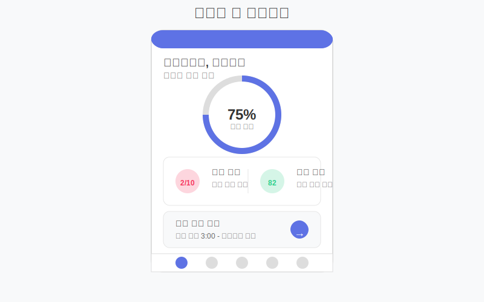
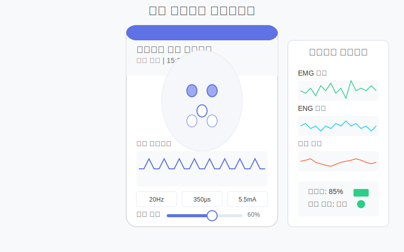
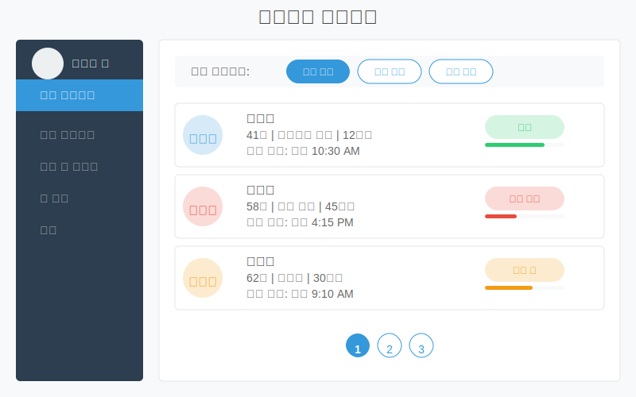

# 사용자 인터페이스 디자인

신경재생을 위한 적응형 신경 전기자극 시스템은 환자와 의료진 모두가 효과적으로 사용할 수 있는 직관적인 인터페이스가 필수적입니다. 이 문서에서는 환자용 모바일 애플리케이션과 의료진을 위한 전문가 대시보드의 디자인 개념을 설명합니다.

## 1. 환자 중심 모바일 애플리케이션

### 1.1 핵심 디자인 원칙

- **접근성 최우선**: 다양한 운동 및 감각 능력 수준을 고려한 적응형 인터페이스
- **직관적 시각화**: 복잡한 의학적 정보를 이해하기 쉬운 시각적 요소로 표현
- **개인화**: 환자의 상태, 진행 상황, 선호도에 맞춰 조정되는 맞춤형 경험
- **점진적 복잡성**: 초기에는 단순한 기능으로 시작하여 환자가 익숙해짐에 따라 고급 기능 소개
- **심리적 지원**: 긍정적 피드백과 성취감을 제공하는 요소 통합

### 1.2 주요 인터페이스 구성요소

#### 1.2.1 홈 대시보드

- **현재 상태 요약**: 간단한 시각적 표시로 현재 치료 상태 및 중요 지표 표시
- **일일 목표 진행률**: 원형 진행 표시기로 당일 치료 및 활동 완료율 시각화
- **예정된 세션**: 다음 치료 세션 및 알림 설정
- **중요 알림**: 우선순위가 높은 알림 및 조치 사항

#### 1.2.2 치료 모니터링 및 제어

- **실시간 자극 시각화**: 현재 활성화된 자극 패턴 및 매개변수 실시간 표시
- **감각 피드백 인터페이스**: 자극 감각에 대한 주관적 피드백 입력 메커니즘
  - 강도, 불편함, 감각 품질 등 평가 슬라이더
  - 터치 인터페이스로 감각 위치 지정
- **안전 제어**: 긴급 중지 및 강도 조절 기능 (의사가 설정한 안전 범위 내)
- **세션 타이머**: 현재 세션 진행 시간 및 남은 시간 표시

#### 1.2.3 회복 진행 추적기

- **다차원 진행 시각화**: 운동 기능, 감각 회복, 통증 수준 등 주요 영역별 진행 상황
- **장기 추세 그래프**: 시간에 따른 주요 지표 변화 추세
- **기능별 회복 지도**: 신체 부위별 기능 회복 수준을 색상 코드로 표시한 인터랙티브 맵
- **마일스톤 기념**: 중요 회복 단계 달성 시 시각적 축하 및 인센티브

#### 1.2.4 일지 및 증상 기록

- **간편 입력 메커니즘**: 미리 정의된 증상 및 상태 옵션으로 빠른 기록
- **일일 웰빙 체크인**: 기분, 통증, 피로도, 수면 품질 등 간단한 평가
- **맥락 캡처**: 증상 발생 전/중/후 활동 및 환경 기록
- **사진 및 음성 메모**: 움직임이나 가시적 변화를 기록하는 멀티미디어 옵션

#### 1.2.5 교육 및 지원 허브

- **맞춤형 교육 모듈**: 환자의 상태 및 진행 단계에 맞춘 정보
- **대화형 튜토리얼**: 장치 사용 및 자가 관리 기술에 대한 단계별 가이드
- **가상 코칭**: 운동 및 활동에 대한 실시간 지침 및 피드백
- **커뮤니티 연결**: 유사한 상태의 다른 환자들과의 선택적 연결 및 경험 공유

### 1.3 게임화 및 참여 요소

- **적응형 도전과제**: 환자의 현재 능력에 맞춰진 일일/주간 목표
- **진행 보상**: 일관된 참여와 목표 달성에 대한 디지털 배지 및 보상
- **일상 통합**: 재활 활동을 일상생활의 자연스러운 부분으로 만드는 상황 기반 알림
- **성공 시각화**: 시간 경과에 따른 진행 상황을 강조하는 애니메이션 및 시각적 요소

### 1.4 접근성 고려사항

- **다양한 운동 능력 지원**: 다양한 입력 방법 (음성, 안구 추적, 단일 터치, 제스처)
- **맞춤형 인터페이스 크기**: 저시력 사용자를 위한 확대 텍스트 및 요소
- **색상 대비**: 색맹을 고려한 색상 선택 및 높은 대비
- **음성 피드백**: 모든 시각적 요소에 대한 오디오 대안
- **간소화 모드**: 인지 부하를 줄이기 위한 기본 기능만 표시하는 옵션

## 2. 임상의를 위한 전문가 대시보드

### 2.1 핵심 디자인 원칙

- **효율적 워크플로우**: 의사결정을 가속화하는 데이터 중심 인터페이스
- **종합적 시각화**: 복잡한 다차원 데이터의 직관적 표현
- **우선순위 지정**: 중요한 알림 및 이상 징후를 강조하는 지능형 필터링
- **유연한 심층 분석**: 표면적 개요에서 세부 데이터까지 원활한 전환
- **협업 지원**: 다학제적 의료팀 간의 원활한 정보 공유 및 커뮤니케이션

### 2.2 주요 인터페이스 구성요소

#### 2.2.1 환자 관리 대시보드

- **환자 개요 그리드**: 환자별 핵심 지표 및 경고를 보여주는 비주얼 요약
- **우선순위 큐**: 즉각적인 관심이 필요한 환자를 상단에 표시
- **필터링 및 정렬 도구**: 다양한 기준(상태, 진행도, 최근 활동)으로 환자 목록 구성
- **일정 및 작업**: 예정된 조정, 검토 및 후속 조치 통합 보기

#### 2.2.2 개별 환자 프로필

- **종합 상태 개요**: 중요 생체 지표, 치료 매개변수, 진행 지표를 단일 화면에 표시
- **상호작용적 타임라인**: 치료 이벤트, 매개변수 조정, 증상 보고의 시간적 매핑
- **다중 데이터 스트림 시각화**: 여러 생체신호 및 성능 지표를 동기화된 방식으로 표시
- **이상치 및 패턴 하이라이트**: AI 지원 분석으로 주목할 만한 추세 및 이벤트 강조

#### 2.2.3 치료 계획 인터페이스

- **프로토콜 디자이너**: 드래그 앤 드롭 인터페이스로 자극 패턴 시각적 프로그래밍
- **매개변수 시뮬레이션**: 조정 효과의 예측 시각화
- **템플릿 라이브러리**: 사전 구성된 프로토콜과 개인화를 위한 수정 옵션
- **단계적 진행 계획**: 재생 단계에 따른 장기 치료 경로 매핑
- **규정 준수 확인**: 안전 매개변수 범위 및 임상 지침과의 일치성 자동 검증

#### 2.2.4 분석 및 통찰 허브

- **다차원 데이터 탐색기**: 생체신호, 치료 매개변수, 결과 측정 간의 관계 시각화
- **코호트 비교 도구**: 유사한 환자 그룹 대비 개별 환자 성과 분석
- **예측 모델링**: 현재 궤적 기반 예상 회복 경로 및 결과
- **이상 탐지**: 예상 패턴에서 벗어난 반응 또는 진행에 대한 자동 알림
- **맞춤형 보고서 생성기**: 다양한 청중(환자, 보험사, 다른 전문가)을 위한 시각적 요약

#### 2.2.5 원격 모니터링 및 조정

- **실시간 장치 상태**: 현재 활성 매개변수, 배터리 상태, 연결 품질 모니터링
- **원격 매개변수 조정**: 승인된 범위 내에서 자극 설정 안전한 원격 수정
- **가상 진료 통합**: 화상 상담 중 데이터 및 설정에 직접 액세스
- **스마트 알림 시스템**: 개입이 필요한 조건에 대한 맞춤형 경고
- **감사 추적 및 문서화**: 모든 원격 조정 및 관찰의 자동 기록

### 2.3 데이터 시각화 접근법

- **계층적 정보 설계**: 고수준 요약에서 세부 정보로의 직관적 드릴다운
- **다중 모드 시각화**: 다양한 데이터 유형에 맞는 특화된 차트 및 그래프
  - 시계열 데이터: 인터랙티브 라인 차트와 히트맵
  - 공간 데이터: 신체 매핑 및 토포그래픽 표현
  - 관계 데이터: 네트워크 그래프 및 상관관계 매트릭스
- **상황별 비교**: 기준선, 목표, 통계적 규범과의 직접 비교
- **통합 보기**: 여러 데이터 소스를 의미 있게 결합하여 종합적 통찰 제공

### 2.4 협업 및 워크플로우 기능

- **통합 메시징**: 플랫폼 내 환자별 토론 및 팀 커뮤니케이션
- **작업 할당 및 추적**: 팀 구성원 간 조정 및 후속 조치 관리
- **공동 치료 계획**: 여러 전문가가 동시에 치료 계획에 기여할 수 있는 기능
- **권한 관리**: 역할 기반 접근 제어로 적절한 정보 공유 및 수정 권한 보장
- **의사결정 지원**: 임상 지침, 관련 연구, 유사 사례 기록에 쉽게 접근

## 3. 기술 구현 개념

### 3.1 크로스 플랫폼 아키텍처

- **반응형 웹 애플리케이션**: 모든 장치 크기 및 화면 비율에 적응
- **네이티브 모바일 앱**: iOS 및 Android 장치를 위한 최적화된 성능 및 오프라인 기능
- **클라우드-에지 동기화**: 로컬 처리와 클라우드 기반 분석의 원활한 통합
- **점진적 웹 앱(PWA)**: 오프라인 액세스 및 네이티브 같은 사용자 경험

### 3.2 데이터 아키텍처

- **실시간 동기화**: 장치, 모바일 앱, 클라우드 플랫폼 간 원활한 데이터 흐름
- **계층적 저장**: 중요 데이터는 장치에 로컬로 저장, 확장 분석은 클라우드에 저장
- **시계열 최적화**: 장기 생체신호 및 자극 데이터의 효율적 저장 및 검색
- **캐싱 전략**: 네트워크 중단 중에도 중요 기능 보장

### 3.3 보안 및 개인정보 보호

- **엔드-투-엔드 암호화**: 모든 환자 데이터 및 통신의 보안
- **세분화된 접근 제어**: 사용자 역할 및 필요에 따른 데이터 액세스 제한
- **감사 추적**: 모든 데이터 액세스 및 수정의 변경 불가능한 기록
- **익명화 옵션**: 연구 및 분석 목적의 식별 정보 제거 처리

## 4. 인터페이스 프로토타입

실제 인터페이스 프로토타입을 만들기 위해 고려해야 할 핵심 화면들:

### 4.1 환자 앱 핵심 화면

1. **온보딩 경험**: 개인화된 설정 및 초기 상태 평가
2. **홈 대시보드**: 일일 활동, 진행 상황, 예정된 세션
3. **자극 제어 패널**: 현재 세션 모니터링 및 조정
4. **진행 추적기**: 시간에 따른 다양한 기능적 지표
5. **증상 및 감각 일지**: 사용자 친화적인 입력 인터페이스
6. **교육 콘텐츠**: 대화형 학습 모듈 및 참조 자료
7. **설정 및 환경설정**: 알림, 개인정보, 접근성 조정

### 4.2 임상의 대시보드 핵심 화면

1. **환자 개요 그리드**: 관리 중인 모든 환자의 상태 요약
2. **개별 환자 대시보드**: 특정 환자에 대한 종합 상태 보기
3. **치료 프로토콜 디자이너**: 시각적 프로그래밍 인터페이스
4. **생체신호 분석기**: 복잡한 데이터에 대한 다차원 시각화
5. **보고서 생성기**: 맞춤형 임상 문서 생성
6. **팀 협업 허브**: 메시징 및 공유 작업 공간
7. **관리 패널**: 역할, 권한, 시스템 설정

### 4.3 모바일 앱 UI 예시 개념

아래는 간단한 모바일 앱 인터페이스의 주요 화면을 설명합니다. 각 화면은 실제 구현을 위한 기초적인 개념으로 활용될 수 있습니다.

#### 홈 대시보드
- 상단: 사용자 인사말 및 오늘의 상태 요약
- 중앙: 원형 진행률 표시기(일일 목표 달성도)
- 주요 지표 카드: 통증 수준, 활동 점수, 회복 진행률
- 하단: 다음 치료 세션 일정 및 빠른 액션 버튼

#### 치료 모니터링
- 상단: 현재 활성 프로토콜 이름 및 상태
- 중앙: 활성 전극 위치의 시각적 표현
- 파라미터 표시: 현재 주파수, 강도, 파형 패턴
- 조절 컨트롤: 안전 범위 내에서 강도 슬라이더
- 하단: 긴급 중지 버튼 및 세션 타이머

#### 진행 추적
- 탭 구조: 운동 기능 / 감각 회복 / 통증 관리
- 각 섹션별 시간에 따른 추세 그래프
- 주간/월간/전체 기간 전환 보기
- 주요 이벤트 및 마일스톤 표시
- 신체 부위별 회복 수준 시각화

## 5. 사용자 테스트 및 반복

### 5.1 사용자 중심 설계 프로세스

1. **초기 요구사항 수집**: 환자 및 임상의 인터뷰를 통한 주요 니즈 식별
2. **저충실도 프로토타이핑**: 핵심 기능 흐름의 빠른 반복
3. **사용성 테스트**: 실제 사용자를 대상으로 한 태스크 기반 평가
4. **접근성 검토**: 다양한 능력을 가진 사용자의 테스트 및 피드백
5. **고충실도 프로토타이핑**: 시각적 디자인 및 상호작용 상세화
6. **파일럿 구현**: 제한된 사용자 그룹과의 실제 환경 테스트
7. **지속적 개선**: 사용 데이터 및 피드백을 기반으로 한 반복

### 5.2 성능 지표

- **태스크 완료율**: 사용자가 주요 기능을 성공적으로 사용하는 비율
- **시간 효율성**: 핵심 태스크 완료에 필요한 시간
- **오류율**: 사용자가 경험하는 오류 및 혼란 지점
- **사용자 만족도**: 표준화된 도구(SUS, UEQ)를 통한 주관적 평가
- **접근성 준수**: WCAG 지침에 대한 준수 수준
- **인지 부하**: 인터페이스 사용 중 지각된 정신적 노력